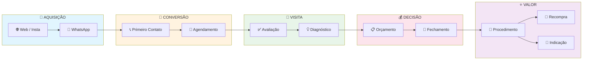
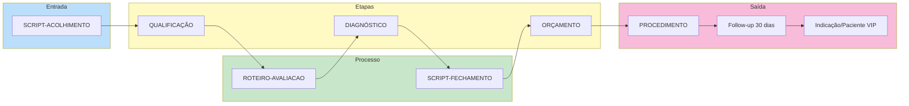
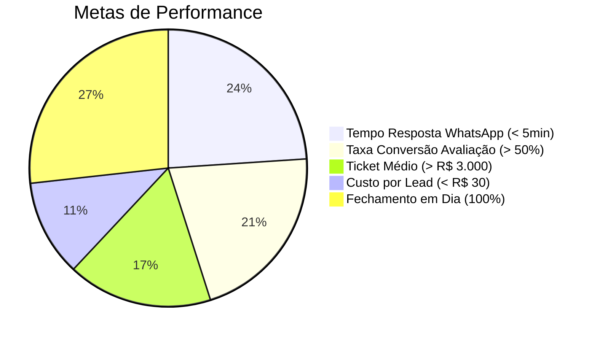

# 🗺️ Mapa de Processos - Clínica Dra. Patrícia

> [!NOTE] Visão Geral
> Este mapa mostra como os processos principais da clínica se conectam.

---

## 🔄 FLUXO PRINCIPAL (Funil de Vendas)



---

## 📋 PROCESSOS POR SETOR

### 🦷 Processos Clínicos

| Processo | Dono | Status |
|----------|------|--------|
| Fluxo de Atendimento | Dra. Patrícia | ✅ |
| Protocolo Botox | Dra. Patrícia | ⏳ |
| Protocolo Implante | Dra. Patrícia | ⏳ |
| Protocolo Lentes | Dra. Patrícia | ⏳ |
| Pós-operatório | Secretaria | ⏳ |

### 💰 Processos de Vendas

| Processo | Dono | Status |
|----------|------|--------|
| Qualificação de Lead | Secretaria | ✅ |
| Apresentação de Valor | Dra. Patrícia | ✅ |
| Fechamento | Secretaria | ✅ |
| Follow-up | Secretaria | ✅ |
| Indicação | Paciente | ✅ |

### 📢 Processos de Marketing

| Processo | Dono | Status |
|----------|------|--------|
| Estratégia de Conteúdo | Terceiro/Dra | ✅ |
| Campanhas Pagas | Terceiro | ⏳ |
| Campanhas Orgânicas | Dra/Time | ✅ |
| Gestão de Redes | Terceiro | ⏳ |

### 💵 Processos Financeiros

| Processo | Dono | Status |
|----------|------|--------|
| Precificação | Dra. Patrícia | ✅ |
| Fluxo de Caixa | Secretaria/Gerente | ✅ |
| Análise de Despesas | Dra. Patrícia | ✅ |
| Comissão | Gestão | ✅ |

### 👥 Processos de RH

| Processo | Dono | Status |
|----------|------|--------|
| Recrutamento | Dra. Patrícia | ✅ |
| Onboarding | Dra. Patrícia | ⏳ |
| Treinamento | Dra. Patrícia | ✅ |
| Rotinas Semanais | Time | ⏳ |

---

## 🔗 FLUXO DE VENDAS (Detalhado)

```mermaid
flowchart TD
    subgraph QUALIFICAÇÃO["1️⃣ QUALIFICAÇÃO"]
        Q1{Lead vem de<br/>Web/Insta?}
        Q2[👋 Saudação<br/>Personalizada]
        Q3[❓ Identificar<br/>Necessidade]
    end

    subgraph INTERESSE["2️⃣ INTERESSE"]
        I1[📋 Informar<br/>Valores/Serviços]
        I2[🎁 Oferecer<br/>Avaliação Gratuita]
        I3[📅 Confirmar<br/>Horário]
    end

    subgraph VISITA["3️⃣ VISITA"]
        V1[🏥 Chegada<br/>do Paciente]
        V2[📝 Anamnese<br/>Completa]
        V3[🔍 Exame<br/>Clínico]
        V4[📸 Documentação<br/>Fotográfica]
    end

    subgraph PROPOSTA["4️⃣ PROPOSTA"]
        P1[Apresentar<br/>Tratamento]
        P2[💎 Ancoragem<br/>de Valor]
        P3[💳 Opções de<br/>Pagamento]
        P4{🤔 Paciente<br/>Decide?}
    end

    subgraph FECHAMENTO["5️⃣ FECHAMENTO"]
        F1[✅ Assinatura<br/>Contrato]
        F2[💰 Entrada<br/>Confirmada]
        F3[📆 Agendar<br/>Procedimento]
    end

    subgraph PÓS_VENDA["6️⃣ PÓS-VENDA"]
        PV1[📞 Follow-up<br/>24h]
        PV2[🦷 Procedimento]
        PV3[⭐ Pesquisa<br/>Satisfação]
        PV4[🎁 Programa<br/>Indicação]
    end

    Q1 --> Q2 --> Q3 --> I1 --> I2 --> I3 --> V1
    V1 --> V2 --> V3 --> V4 --> P1
    P1 --> P2 --> P3 --> P4
    P4 -->|Sim| F1 --> F2 --> F3 --> PV1 --> PV2
    P4 -->|Não| PV4
    PV2 --> PV3 --> PV4

    style QUALIFICAÇÃO fill:#e3f2fd
    style INTERESSE fill:#fff8e1
    style VISITA fill:#e8f5e9
    style PROPOSTA fill:#fce4ec
    style FECHAMENTO fill:#e1f5fe
    style PÓS_VENDA fill:#f3e5f5
```



---

## 🔗 CONEXÕES ENTRE PROCESSOS



---

## ⏱️ TEMPOS DE RESPOSTA

```mermaid
gantt
    title Ciclo de Conversão
    dateFormat  HH:mm
    axisFormat  %H:%M
    
    section resposta
    WhatsApp          :done,    0h 2min
    Agendamento       :done,    0h 5min
    Confirmação       :done,    0h 10min
    
    section visita
    Anamnese          :active,  0h 20min
    Exame             :active,  0h 15min
    Proposta          :active,  0h 25min
    
    section decisão
   考虑时间      :           24h
    Fechamento  :           48h
```

---

## 📊 KPIs de Processos



---

## ✅ Checklist de Implementação

- [x] Criar estrutura de pastas
- [x] Mapear processos principais
- [ ] Definir donos de cada processo
- [ ] Criar/validar cada processo documentado
- [ ] Treinar equipe
- [ ] Implementar follow-up semanal

---

> [!TIP] Como Usar
> Este documento é o **mapa central**. Para navegar entre os processos, use os links internos do Obsidian `[[nome-do-processo]]`.
