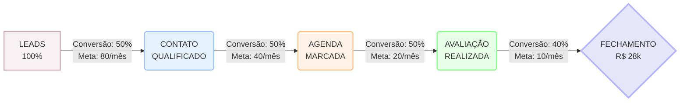

# 💰 Funil de Vendas - Clínica Dra. Patrícia

> [!ABSTRACT] Visão Geral
> Pipeline completo de conversão do lead ao paciente final.

---

## 📊 VISÃO GERAL DO FUNIL

---

## 🔢 NÚMEROS ALVO (Meta 100K)

| Etapa | Volume | Conversão | Percentual |
|-------|--------|-----------|------------|
| Leads novos | 80 | - | 100% |
| Contatos qualificados | 40 | 50% | 50% |
| Agendas marcadas | 20 | 50% | 25% |
| Avaliações realizadas | 10 | 50% | 12.5% |
| Fechamentos | 4 | 40% | 5% |
| **Faturamento (ticket médio R$7k)** | - | - | **R$ 28k** |

> [!NOTE] Gap para 100K
> Para atingir R$ 100k, precisamos de ~14-16 fechamentos de alto valor por mês ou aumentar ticket médio.

---

## 🎯 ETAPAS DO FUNIL

### ETAPA 1: GERAÇÃO DE LEADS

#### Canais de Aquisição

| Canal | Volume Esperado | Custo Estimado | Responsável |
|-------|-----------------|----------------|-------------|
| Tráfego Pago (Meta/Google) | 40 leads/mês | R$ 2.000-4.000/mês | Terceiro/Agência |
| Orgânico (Instagram/Reels) | 20 leads/mês | Tempo Dra. | Dra. + Terceiro |
| Indicações pacientes | 15 leads/mês | Brinde/sorteio | Secretaria |
| WhatsApp/Glow | 5 leads/mês | N/A | Secretaria |
| **TOTAL** | **~80 leads** | **R$ 2-4k** | - |

#### Ações para Aumentar Leads
- [ ] Otimizar campanhas de tráfego pago
- [ ] Postar 2x semana Reels (antes/depois + autoridade)
- [ ] Ativar programa de indicação
- [ ] Melhorar bio do Instagram

---

### ETAPA 2: QUALIFICAÇÃO DO LEAD

#### Critérios de Qualificação

| Qualificado | Não Qualificado |
|-------------|-----------------|
| Tem problema que solucionamos | Só pesquisando preço |
| Tem interesse em procedimento | Não tem condições financeiras |
| Disposto avir para avaliação | Não tem disponibilidade |
| Budget para tratamento | Expectativas irreais |

#### Script de Qualificação
> [[SCRIPT-ACOLHIMENTO]]

#### Tempo de Resposta
> **Meta: < 5 minutos** após o primeiro contato

---

### ETAPA 3: AGENDAMENTO

#### Processo de Agendamento
1. Identificar interesse específico
2. Oferecer horários disponíveis (2 opções)
3. Confirmar e enviar lembrete
4. Ligação de confirmação 24h antes

#### Checklist Agendamento
- [ ] Confirmar nome e procedimento
- [ ] Oferecer 2 opções de horários
- [ ] Enviar endereço e instruções
- [ ] Programar lembrete 24h antes
- [ ] Ligar confirmação no día

---

### ETAPA 4: AVALIAÇÃO

#### O que acontece na avaliação
1. Anamnese completa
2. Escuta ativa (dores e desejos)
3. Documentação visual (fotos)
4. Diagnóstico e explicação
5. Apresentação do plano de tratamento
6. Transferência para fechamento

#### Documentação
- [ ] Fotos intraorais
- [ ] Raio-x se necessário
- [ ] Mapa de problemas
- [ ] Plano de tratamento por escrito

> [!TIP] Gatilho de Autoridade
> Mostrar casos similares resolvidos. A Dra. tem +16 anos de experiência e foi Oficial do Exército.

---

### ETAPA 5: FECHAMENTO

#### Processo de Fechamento
1. Secretário recebe "passagem de bastão"
2. Levar para sala reservada
3. Apresentar valor (não preço)
4. Oferecer formas de pagamento
5. Pré-agendar (nunca deixar "vou pensar")
6. Responder objeções

#### Scripts
- [[SCRIPT-FECHAMENTO]]
- [[SCRIPT-TRATAMENTO]]

---

## 🔄 FOLLOW-UP DO FUNIL

### Rotina Semanal de Follow-up

| Dia | Ação |
|-----|------|
| Segunda | Revisar agenda da semana |
| Terça | Ligar para agendamentos da semana |
| Quinta | Follow-up de orçamentos pendentes |
| Sexta | Análise de resultados da semana |

### Critérios de Follow-up

| Situação | Ação | Quando |
|----------|------|--------|
| Não fechou avaliação | [[SCRIPT-REATIVACAO-1]] | 3 dias após |
| Sumiu após orçamento | [[SCRIPT-REATIVACAO-2]] | 7 dias após |
| Orçamento aberto | Oferecer condições | 14 dias após |
| Paciente em tratamento | NPS + lembrete retorno | 30 dias após |

---

## 📊 KPIs DO FUNIL

| Etapa | KPI | Meta | Atual |
|-------|-----|------|-------|
| Geração | Custo por lead | < R$ 30 | ? |
| Qualificação | Taxa resposta < 5min | > 80% | ? |
| Agendamento | Taxa show-up | > 90% | ? |
| Avaliação | Taxa conversão | > 50% | ? |
| Fechamento | Taxa fechamento | > 40% | ? |
| Geral | Ticket médio | > R$ 5k | ? |

---

## 🔗 Links Relacionados

- [[META-100K]]
- [[SCRIPT-ACOLHIMENTO]]
- [[SCRIPT-FECHAMENTO]]
- [[SCRIPT-FOLLOW-UP]]
- [[ROTEIRO-AVALIACAO]]
- [[FLUXO-ATENDIMENTO]]

---

## ✅ Checklist de Implementação

- [ ] Mapear funnel atual (métricas)
- [ ] Definir responsável por cada etapa
- [ ] Implementar CRM/Kommo
- [ ] Criar scripts de follow-up
- [ ] Treinar equipe
- [ ] Revisar semanalmente

> [!NOTE] Lembrete
> O funil não é estático. Revisite e otimize toda semana baseado nos dados.