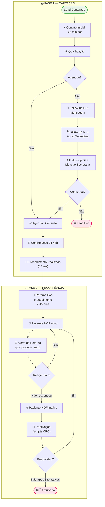

# 💉 Funil de Harmonização Facial (HOF) - Clínica Dra. Patrícia

> [!ABSTRACT] Visão Geral
> Funil exclusivo para pacientes de Harmonização Orofacial. Dividido em duas fases: **Captação** (converter o lead em paciente) e **Recorrência** (garantir os retornos periódicos). A recorrência é o principal diferencial deste funil — procedimentos como botox, preenchimento e bioestimuladores têm prazo de validade e geram **receita previsível e mensal** quando bem gerenciados.

---

## 🗺️ FLUXO COMPLETO

---

## 📋 FASE 1 — CAPTAÇÃO

### 📞 1. Contato Inicial
**Responsável:** Secretária (CRC)
**Meta:** Responder em menos de 5 minutos

> [!TIP] Leads de HOF são quentes
> Quem busca harmonização geralmente já pesquisou, já viu resultados e está com desejo ativo. Resposta rápida é ainda mais crítica aqui do que na odontologia.

**Script:** [[SCRIPT-ACOLHIMENTO]]

---

### 🔍 2. Qualificação
**Responsável:** Secretária (CRC)

#### Perguntas-chave para HOF
1. Qual procedimento tem interesse? (botox, filler, bioestimulador, outros?)
2. Já realizou algum procedimento de harmonização antes?
3. Tem alguma contraindicação conhecida? (gestação, doenças autoimunes)
4. Tem disponibilidade para vir essa semana?

| ✅ Lead Qualificado | ❌ Não Qualificado |
|--------------------|-------------------|
| Interesse claro em procedimento | Só comparando preços |
| Sem contraindicações evidentes | Gestante ou contraindicação clínica |
| Disposta a agendar avaliação | Sem disponibilidade |

---

### 📅 3. Agendamento
**Responsável:** Secretária (CRC)

- [ ] Oferecer 2 opções de horário
- [ ] Confirmar nome e contato
- [ ] Enviar endereço e instruções
- [ ] Programar confirmação 24-48h antes

---

### 📱 4. Sequência de Follow-up (não agendou)

#### D+1 — Mensagem de texto
> *"Oi [Nome]! Tudo bem? Só passando para saber se ficou alguma dúvida sobre os procedimentos de harmonização da Dra. Patrícia. Estou à disposição 😊"*

#### D+3 — Áudio da Secretária (~30 segundos)
> *"Oi [Nome], aqui é [Secretária] da clínica da Dra. Patrícia. Estou entrando em contato porque você demonstrou interesse em harmonização e queria saber se consigo te ajudar a agendar uma avaliação. A Dra. tem agenda limitada, mas ainda tenho horário essa semana. Me manda uma mensagem quando puder!"*

#### D+7 — Ligação da Secretária
> [!WARNING] Última tentativa ativa
> Após D+7 sem retorno, mover para **Lead Frio**. Reativar em campanhas sazonais.

---

### 🔔 5. Confirmação da Consulta
**Quando:** 24 a 48h antes

- [ ] Mensagem WhatsApp de lembrete
- [ ] Ligar se não confirmar em 4h
- [ ] Reenviar endereço e orientações pré-procedimento

> [!DANGER] Orientações pré-HOF importantes
> Lembrar a paciente: não usar anticoagulantes, evitar álcool 24h antes, não estar menstruada (aumenta sensibilidade). Isso reduz cancelamentos de última hora.

---

### 💉 6. Procedimento Realizado (1ª vez)
**Critério:** Paciente compareceu e realizou o procedimento
**Ação imediata:** Avançar para **Fase 2 — Recorrência**

- [ ] Registrar procedimento realizado e data
- [ ] Registrar produto utilizado e quantidade (botox: unidades; filler: ml)
- [ ] Orientar sobre cuidados pós-procedimento
- [ ] Informar sobre o retorno de avaliação em 7-15 dias
- [ ] Agendar retorno pós-procedimento antes de sair

---

## 🔄 FASE 2 — RECORRÊNCIA

> [!ABSTRACT] Por que esta fase é tão importante?
> Uma paciente de botox que retorna a cada 4 meses = **3 procedimentos/ano**.
> Com ticket médio de R$ 800 = **R$ 2.400/ano por paciente**.
> 20 pacientes fiéis = **R$ 48.000/ano só em recorrência de botox**.
> Gerenciar essa recorrência é transformar harmonização em **receita previsível**.

---

### 🔎 7. Retorno Pós-Procedimento (7 a 15 dias)
**Quando:** 7 a 15 dias após o procedimento
**Objetivo:** Avaliar resultado, corrigir assimetrias, fidelizar

- [ ] Agendar presencialmente ou enviar mensagem de acompanhamento
- [ ] Verificar satisfação com o resultado
- [ ] Registrar feedback
- [ ] Orientar sobre data do próximo retorno (conforme tabela abaixo)

> *"Oi [Nome]! Já faz [X] dias desde seu procedimento com a Dra. Patrícia 😊 Como você está se sentindo com o resultado? Alguma dúvida ou algo que queira ajustar? Estamos à disposição!"*

---

### 💛 8. Paciente HOF Ativo
**Critério:** Paciente em ciclo de manutenção ativo
**Responsável:** Secretária (CRC)

#### Tabela de Retorno por Procedimento

| Procedimento | Duração média | Alerta de retorno | Ação |
|-------------|--------------|-------------------|------|
| Toxina Botulínica (Botox) | 4-6 meses | **4 meses** | Mensagem proativa |
| Preenchimento Labial | 8-12 meses | **7 meses** | Mensagem proativa |
| Preenchimento de Olheiras | 12-18 meses | **11 meses** | Mensagem proativa |
| Bioestimuladores (Sculptra, Radiesse) | 12-18 meses | **12 meses** | Mensagem proativa |
| Fios de PDO | 12-18 meses | **12 meses** | Mensagem proativa |
| Skinbooster | 4-6 meses | **4 meses** | Mensagem proativa |

> [!TIP] Registrar tudo no sistema
> Data do procedimento + produto + quantidade → é a base para calcular o alerta de retorno correto para cada paciente.

---

### ⏰ 9. Alerta de Retorno
**Quando:** Conforme tabela acima — de forma **proativa**, antes do prazo vencer
**Responsável:** Secretária (CRC)

> [!TIP] Seja proativa, não reativa
> Não espere a paciente lembrar. A clínica que avisa no momento certo **vira referência de cuidado** — e a paciente nunca mais vai procurar outra.

#### Script de Retorno — Botox (4 meses)
> *"Oi [Nome]! Aqui é [Secretária] da clínica da Dra. Patrícia 😊 Já estamos chegando nos 4 meses do seu botox — exatamente na hora de renovar para manter o resultado fresquinho! A agenda da Dra. está bem disputada, mas ainda consigo te encaixar essa semana. Vamos agendar?"*

#### Script de Retorno — Filler/Bioestimulador
> *"Oi [Nome]! Tudo bem? Aqui é [Secretária] da clínica da Dra. Patrícia. Passando para avisar que o prazo de manutenção do seu [procedimento] está chegando — e é agora, com o produto ainda ativo, que a manutenção tem melhor resultado e custo menor. Quer garantir seu horário?"*

---

### ❄️ 10. Paciente HOF Inativo
**Critério:** Não respondeu ao alerta de retorno nem reagendou
**Responsável:** Secretária (CRC)

#### Sequência de Reativação

| Tentativa | Canal | Tom | Script |
|-----------|-------|-----|--------|
| 1ª — D+0 | WhatsApp (texto) | Saudade, cuidado | [[SCRIPT-REATIVACAO-WHATSAPP-GENERAL]] |
| 2ª — D+5 | WhatsApp (áudio) | Pessoal, urgência leve | [[SCRIPT-REATIVACAO-LIGACAO]] |
| 3ª — D+15 | Ligação | Direto, última tentativa | [[SCRIPT-REATIVACAO-ULTIMA-TENTATIVA]] |

> [!NOTE] Reativação específica para HOF
> Mencionar que o efeito do procedimento anterior pode estar perdendo força — isso cria urgência real e genuína, sem pressão artificial.

> *"[Nome], aqui é [Secretária]. Já faz um tempinho desde seu último procedimento com a Dra. Patrícia e fiquei preocupada — o efeito do botox começa a reduzir por volta dos 4-5 meses. Não quero que você perca o resultado que conquistou! Consigo encaixar você ainda essa semana?"*

---

## 📊 KPIs DO FUNIL HOF

| Indicador | Meta |
|-----------|------|
| Tempo de resposta ao lead | < 5 minutos |
| Taxa de conversão lead → consulta | > 50% |
| Taxa de show-up (comparecimento) | > 80% |
| Taxa de retorno pós-procedimento (7-15 dias) | > 70% |
| Taxa de reagendamento no alerta de retorno | > 65% |
| Taxa de reativação de inativas | > 35% |
| Frequência média de procedimentos/paciente/ano | ≥ 2x |
| Receita recorrente mensal (HOF) | Meta: R$ 15.000/mês |

---

## 🔗 Links Relacionados

- [[FUNIL-LEADS]] — Funil de captação geral
- [[FUNIL-PACIENTES]] — Funil odontológico geral
- [[SCRIPT-ACOLHIMENTO]]
- [[SCRIPT-FOLLOW-UP]]
- [[SCRIPT-REATIVACAO-WHATSAPP-GENERAL]]
- [[SCRIPT-REATIVACAO-LIGACAO]]
- [[SCRIPT-REATIVACAO-ULTIMA-TENTATIVA]]
- [[Automacao-Instagram-Kommo]]

---

> [!NOTE] Diferencial Competitivo
> A maioria das clínicas de harmonização **não faz gestão de recorrência** — esperam a paciente ligar. A Dra. Patrícia que avisa no momento certo, com o tom certo, **transforma cada procedimento em um relacionamento de longo prazo**. Isso é o que diferencia uma clínica de R$ 30k/mês de uma de R$ 100k/mês.
