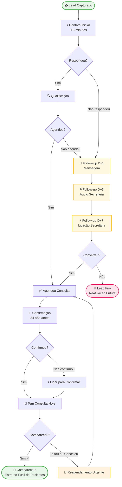

# 🎯 Funil de Leads - Captação de Novos Pacientes

> [!ABSTRACT] Visão Geral
> Funil exclusivo para aquisição de novos pacientes. O lead só sai deste funil e entra no [[FUNIL-VENDAS]] quando **comparecer à consulta e realizar um procedimento**. Enquanto isso não acontece, ele permanece aqui — inclusive após faltas e cancelamentos.

---

## 🗺️ FLUXO COMPLETO DO FUNIL



---

## 📋 ETAPAS DETALHADAS

### 1️⃣ Contato Inicial
**Responsável:** Secretária (CRC)
**Meta de resposta:** < 5 minutos após o lead entrar

| Canal de Entrada | Ação |
|-----------------|------|
| Instagram DM | Responder com script de boas-vindas |
| WhatsApp | Responder com script de boas-vindas |
| Indicação | Mencionar o nome de quem indicou |
| Tráfego Pago | Responder com urgência (lead quente) |

> [!TIP] Regra de Ouro
> Leads respondidos em menos de 5 minutos têm **3x mais chance** de agendar. Nunca deixe para depois.

**Script:** [[SCRIPT-ACOLHIMENTO]]

---

### 2️⃣ Qualificação
**Responsável:** Secretária (CRC)
**Objetivo:** Filtrar leads com perfil para os procedimentos da clínica

#### Perguntas-chave de Qualificação
1. Qual procedimento tem interesse?
2. Já fez alguma avaliação antes?
3. Tem disponibilidade para vir esta semana ou na próxima?

| ✅ Lead Qualificado | ❌ Não Qualificado |
|--------------------|-------------------|
| Interesse em procedimento que realizamos | Só pesquisando preço |
| Disponibilidade para avaliação | Sem disponibilidade de agenda |
| Perfil compatível com os serviços | Expectativas incompatíveis |

> [!WARNING] Atenção
> Lead não qualificado não deve avançar no funil. Finalizar com educação e manter em lista de reativação fria.

---

### 3️⃣ Agendamento
**Responsável:** Secretária (CRC)
**Objetivo:** Converter o lead qualificado em consulta agendada

#### Checklist de Agendamento
- [ ] Confirmar nome completo e contato
- [ ] Oferecer **2 opções de horário** (nunca perguntar "quando você pode?")
- [ ] Registrar no sistema/Kommo
- [ ] Enviar endereço e instruções da clínica
- [ ] Programar lembrete automático de confirmação

> [!TIP] Técnica das 2 Opções
> "Você prefere **terça às 10h** ou **quinta às 15h**?" — evita o "vou ver minha agenda" que mata o agendamento.

---

### 4️⃣ Sequência de Follow-up (Não agendou)

> [!INFO] Quando acionar
> Usar quando o lead qualificado **não agendou** na primeira abordagem, ou não respondeu ao contato inicial.

#### D+1 — Mensagem de Texto
**Canal:** WhatsApp  
**Tom:** Leve, curto, sem pressão  
**Script:** [[SCRIPT-FOLLOW-UP]]

```
"Oi [Nome]! Tudo bem? Só passando para saber se ficou alguma dúvida
sobre [procedimento]. Estou à disposição 😊"
```

---

#### D+3 — Áudio da Secretária
**Canal:** WhatsApp (áudio de ~30 segundos)  
**Tom:** Humano, cuidadoso, pessoal  
**Objetivo:** Humanizar o contato e criar conexão

> [!TIP] Por que áudio?
> Áudios têm taxa de abertura muito maior que texto. A voz da secretária cria proximidade e diferencia da comunicação fria de concorrentes.

**Roteiro do áudio:**
```
"Oi [Nome], aqui é [Nome da Secretária], da clínica da Dra. Patrícia.
Estou entrando em contato porque percebi que você demonstrou interesse
em [procedimento] e queria saber se posso te ajudar a agendar uma
avaliação. A agenda está bem concorrida, mas consigo encaixar você
esta semana. Me manda uma mensagem quando puder!"
```

---

#### D+7 — Ligação da Secretária
**Canal:** Ligação telefônica  
**Tom:** Direto, atencioso, com senso de oportunidade  
**Script:** [[SCRIPT-FOLLOW-UP]]

> [!WARNING] Última tentativa ativa
> Após D+7 sem retorno, o lead passa para **Lead Frio**. Não insistir além disso — respeitar o espaço do lead.

---

### 5️⃣ Confirmação da Consulta
**Responsável:** Secretária (CRC)  
**Quando:** 24 a 48h antes da consulta agendada

#### Checklist de Confirmação
- [ ] Enviar mensagem de lembrete (WhatsApp)
- [ ] Ligar para confirmar presença
- [ ] Reenviar endereço e horário
- [ ] Perguntar se há dúvidas

> [!DANGER] Etapa Crítica
> A confirmação reduz a taxa de falta em até **60%**. Nunca pular esta etapa.

---

### 6️⃣ Tem Consulta Hoje
**Responsável:** Secretária (CRC)  
**Ação:** Verificar presença na agenda, preparar ambiente e recepção

- [ ] Confirmar que a agenda está preparada
- [ ] Avisar Dra. Patrícia sobre o novo lead do dia
- [ ] Recepcionar com atenção especial (primeiro contato presencial)

---

### 7️⃣ Faltou ou Cancelou → Reagendamento
**Responsável:** Secretária (CRC)  
**Objetivo:** Recuperar o lead rapidamente, antes que esfrie

> [!WARNING] Agir em até 2 horas
> Contatar o lead logo após a falta/cancelamento. Quanto mais tempo passa, menor a chance de reagendamento.

#### Fluxo de Reagendamento
1. Enviar mensagem de WhatsApp (tom compreensivo)
2. Se não responder em 4h: ligar
3. Oferecer reagendamento para os próximos **2-3 dias**
4. Se não reagendar em 72h: entra no Follow-up D+1 novamente

```
"Oi [Nome], tudo bem? Notei que não conseguimos nos ver hoje.
Espero que esteja tudo certo! Posso te encaixar ainda essa semana?
Tenho [dia] às [hora] disponível 😊"
```

---

### ❄️ Lead Frio — Reativação Futura
**Quando:** Após D+7 sem resposta, ou após 2+ tentativas de reagendamento sem sucesso

> [!NOTE] Lead frio ≠ lead perdido
> Manter em lista de reativação para campanhas sazonais (Dia das Mães, Black Friday odontológica, aniversário do lead).

**Scripts de reativação:** [[SCRIPT-REATIVACAO-WHATSAPP-GENERAL]] | [[SCRIPT-REATIVACAO-ANIVERSARIO]]

---

## 📊 KPIs DO FUNIL DE LEADS

| Etapa | Indicador | Meta |
|-------|-----------|------|
| Contato Inicial | Tempo de resposta | < 5 minutos |
| Qualificação | Taxa de qualificação | > 60% dos contatos |
| Agendamento | Taxa de conversão lead → consulta | > 50% |
| Follow-up | Taxa de recuperação (D1-D7) | > 20% |
| Confirmação | Taxa de confirmação | > 85% |
| Comparecimento | Taxa de show-up | > 80% |
| Reagendamento | Taxa de recuperação pós-falta | > 50% |

---

## 🔗 Links Relacionados

- [[FUNIL-VENDAS]] — Funil de pacientes (pós-comparecimento)
- [[SCRIPT-ACOLHIMENTO]] — Script etapa 1 e 2
- [[SCRIPT-FOLLOW-UP]] — Scripts D+1, D+3, D+7
- [[SCRIPT-REATIVACAO-WHATSAPP-GENERAL]] — Para leads frios
- [[Treinamento-CRC-Agendamentos]] — Treinamento da secretária
- [[Automacao-Instagram-Kommo]] — Automação de entrada de leads

---

> [!NOTE] Lembrete Estratégico
> Este funil alimenta todo o faturamento da clínica. Cada lead não respondido ou falta não recuperada é receita perdida. Revisar métricas toda semana nas sextas-feiras.
