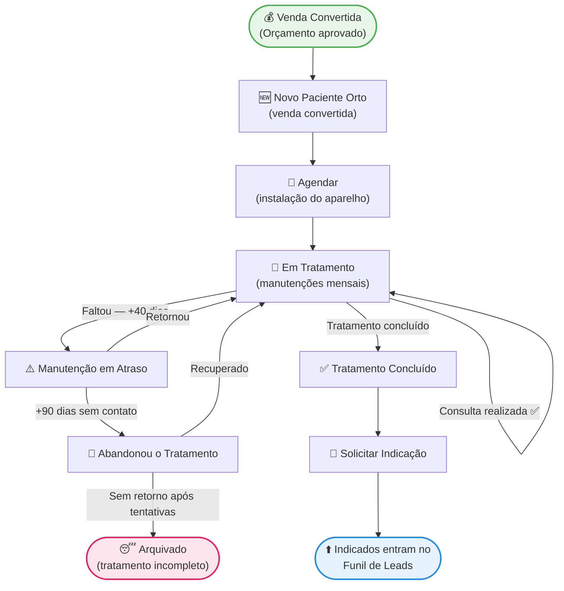

# 🦷 Funil de Ortodontia - Clínica Dra. Patrícia

> [!ABSTRACT] Visão Geral
> Controle exclusivo dos pacientes em tratamento ortodôntico. Devido à longa duração (18 meses a 3 anos) e manutenções mensais obrigatórias, este funil possui etapas de alerta para atrasos e abandono. O paciente entra quando a **venda do tratamento ortodôntico é convertida**.

---

## 🗺️ FLUXO COMPLETO

---

## 📋 ETAPAS DETALHADAS

### 🆕 1. Novo Paciente Orto
**Critério de entrada:** Venda do tratamento ortodôntico convertida (contrato assinado e entrada paga)
**Responsável:** Secretária (CRC)

#### Ações na entrada
- [ ] Cadastrar no sistema com data de início e valor total do contrato
- [ ] Registrar forma de pagamento (parcelas mensais)
- [ ] Enviar mensagem de boas-vindas com orientações iniciais
- [ ] Mover para **Agendar** para marcar a instalação do aparelho

#### Mensagem de Boas-vindas
> *"Oi [Nome]! Seja bem-vindo(a) à família da clínica da Dra. Patrícia! 🦷 Estamos muito felizes em cuidar do seu sorriso. Em breve nossa equipe vai entrar em contato para agendar sua consulta de instalação. Qualquer dúvida, pode me chamar aqui!"*

---

### 📅 2. Agendar
**Critério:** Paciente cadastrado, aguardando agendamento da instalação do aparelho
**Responsável:** Secretária (CRC)

#### Ações
- [ ] Entrar em contato para agendar a instalação
- [ ] Oferecer 2 opções de horário
- [ ] Confirmar agendamento e enviar lembrete 48h antes
- [ ] Orientar sobre preparação para a instalação (higiene, alimentação)
- [ ] Mover para **Em Tratamento** após a instalação realizada

> [!WARNING] Não deixar na fila
> Paciente em "Agendar" sem data marcada por mais de 3 dias deve ser acionado imediatamente — o entusiasmo da compra esfria rápido.

---

### 🔄 3. Em Tratamento
**Critério:** Aparelho instalado, consultas mensais em andamento
**Responsável:** Secretária (agendamentos) + Dra. Patrícia (clínico)

> [!WARNING] Regra Crítica da Ortodontia
> Todo paciente deve **sempre sair da consulta com a próxima já agendada**. Nunca deixar "você me liga para marcar" — isso é a principal causa de atraso e abandono.

#### Rotina Mensal
- [ ] Confirmar consulta 48h antes (WhatsApp)
- [ ] Realizar atendimento
- [ ] Agendar próxima consulta antes do paciente sair
- [ ] Registrar evolução no prontuário
- [ ] Verificar se parcela do mês está em dia

#### Monitoramento de Prazo

| Situação | Alerta | Ação |
|----------|--------|------|
| Última consulta há **> 40 dias** | 🟡 Amarelo | Enviar mensagem de lembrete |
| Última consulta há **> 60 dias** | 🟠 Laranja | Ligar pessoalmente |
| Última consulta há **> 90 dias** | 🔴 Vermelho | Mover para **Manutenção em Atraso** |

---

### ✅ 4. Tratamento Concluído
**Critério:** Tratamento concluído com resultado aprovado pela Dra. Patrícia
**Responsável:** Secretária (CRC) + Dra. Patrícia

#### Ações na Conclusão
- [ ] Registrar data de conclusão e duração total do tratamento
- [ ] Fotografar resultado final (antes e depois)
- [ ] Orientar sobre contenção/uso de retentores (se aplicável)
- [ ] Coletar depoimento/avaliação (Google, Instagram ou vídeo)
- [ ] Parabenizar o paciente com mensagem especial
- [ ] Avançar para **Solicitar Indicação**

#### Mensagem de Parabéns
> *"[Nome], chegou o grande dia! 🎉 Foi uma jornada incrível e estamos muito orgulhosos do resultado que você conquistou. Obrigada pela confiança na Dra. Patrícia e na nossa equipe. Agora é mostrar esse sorriso para o mundo! 😁"*

---

### 🤝 5. Solicitar Indicação
**Critério:** Imediatamente após o tratamento concluído
**Responsável:** Secretária (CRC)

> [!TIP] Momento Ideal
> Paciente de ortodontia tem uma história longa com a clínica — meses ou anos de relacionamento. O vínculo criado nesse período é o maior ativo para gerar indicações de qualidade.

#### Script de Indicação
> *"[Nome], você viveu essa transformação na nossa clínica e sabe melhor do que ninguém o cuidado que a Dra. Patrícia tem. Você conhece alguém — filho, sobrinho, amigo — que precisaria de ortodontia? Se você indicar e a pessoa agendar uma avaliação, temos um presente especial para você como agradecimento!"*

#### Ações
- [ ] Registrar indicações recebidas
- [ ] Enviar benefício ao paciente que indicou
- [ ] Inserir indicados no [[FUNIL-LEADS]]

---

### ⚠️ 6. Manutenção em Atraso
**Critério:** Paciente em tratamento sem consulta há mais de 40 dias sem justificativa
**Responsável:** Secretária (CRC)

> [!DANGER] Atenção
> Atrasos em ortodontia comprometem o resultado do tratamento e aumentam o tempo total. Agir rápido é importante tanto para o paciente quanto para a clínica.

#### Sequência de Recuperação

| Tentativa | Canal | Prazo | Mensagem |
|-----------|-------|-------|---------|
| 1ª | WhatsApp (texto) | Imediato | Lembrete gentil |
| 2ª | WhatsApp (áudio) | +3 dias | Tom pessoal e cuidadoso |
| 3ª | Ligação | +7 dias | Direto, com senso de urgência |

#### Script — 1ª tentativa (texto)
> *"Oi [Nome]! Aqui é [Secretária] da clínica da Dra. Patrícia. Notei que faz um tempinho desde sua última manutenção do aparelho 😊 Está tudo bem? Vamos reagendar? Tenho horário disponível ainda essa semana!"*

#### Script — 3ª tentativa (ligação)
> *"[Nome], aqui é [Secretária]. Estou ligando porque a Dra. Patrícia ficou preocupada com seu tratamento — cada manutenção em atraso pode prolongar o tempo do aparelho. Vamos encontrar um horário que funcione pra você?"*

#### Após recuperação
- [ ] Reagendar consulta
- [ ] Verificar se houve problema financeiro (parcela atrasada?)
- [ ] Mover de volta para **Em Tratamento**

#### Após 90 dias sem retorno
- [ ] Mover para **Abandonou o Tratamento**

---

### 🚨 7. Abandonou o Tratamento
**Critério:** Paciente sem retorno há mais de 90 dias após tentativas de contato
**Responsável:** Secretária (CRC) + Dra. Patrícia

> [!WARNING] Importante
> Abandono em ortodontia é sério: o paciente pode ter regressão do caso. Além do impacto clínico, é receita e resultado perdidos. Entender o motivo é fundamental.

#### Protocolo de Recuperação

**Passo 1 — Entender o motivo**

| Motivo | Ação |
|--------|------|
| 💸 Financeiro | Renegociar parcelas, oferecer pausa temporária |
| 😣 Desconforto ou dor | Agendar consulta de emergência gratuita |
| 🏙️ Mudança de cidade | Indicar clínica parceira |
| 😴 Procrastinação | Reforçar consequências e facilitar retorno |

**Passo 2 — Script de recuperação**
> *"[Nome], aqui é a Dra. Patrícia. Estou entrando em contato pessoalmente porque me preocupo com o seu tratamento. Sei que às vezes a vida complica, mas quero entender o que aconteceu e ver como posso te ajudar a retomar. Pode me contar o que houve?"*

**Passo 3 — Decisão**
- [ ] Se retornar → mover para **Em Tratamento** (registrar motivo do abandono)
- [ ] Se não retornar após 3 tentativas → arquivar como **Tratamento Incompleto**

---

## 📊 KPIs DO FUNIL DE ORTODONTIA

| Indicador | Meta |
|-----------|------|
| Taxa de conversão venda → instalação | > 95% |
| Taxa de pontualidade mensal | > 85% |
| Taxa de recuperação — manutenção em atraso | > 70% |
| Taxa de abandono | < 10% |
| Taxa de recuperação pós-abandono | > 40% |
| Taxa de conclusão do tratamento | > 85% |
| Indicações geradas por tratamento concluído | ≥ 1 por paciente |

---

## 🔗 Links Relacionados

- [[FUNIL-LEADS]] — Origem dos pacientes
- [[FUNIL-PACIENTES]] — Funil geral odontológico
- [[SCRIPT-ACOLHIMENTO]]
- [[SCRIPT-REATIVACAO-WHATSAPP-GENERAL]]
- [[SCRIPT-REATIVACAO-LIGACAO]]
- [[SCRIPT-REATIVACAO-ULTIMA-TENTATIVA]]

---

> [!NOTE] Diferencial da Ortodontia
> O tratamento ortodôntico é o de **maior duração e maior vínculo** com o paciente na clínica. Um paciente de orto bem cuidado vira embaixador da clínica — cuide do relacionamento em cada manutenção mensal, não apenas na primeira e na última consulta.
