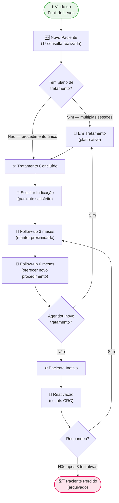

# 🦷 Funil de Pacientes - Clínica Dra. Patrícia

> [!ABSTRACT] Visão Geral
> Controle do ciclo de vida dos pacientes odontológicos em tratamento. O paciente entra neste funil quando **comparece pela primeira vez e realiza um procedimento** (vindo do [[FUNIL-LEADS]]). Pacientes de Harmonização Facial possuem funil próprio: [[FUNIL-HARMONIZACAO]].

---

## 🗺️ FLUXO COMPLETO

---

## 📋 ETAPAS DETALHADAS

### 🆕 1. Novo Paciente
**Origem:** [[FUNIL-LEADS]] — lead que compareceu e realizou procedimento
**Responsável:** Secretária (CRC) + Dra. Patrícia

#### Ações na entrada
- [ ] Cadastrar no sistema (nome, contato, data, procedimento realizado)
- [ ] Registrar origem do lead (Instagram, indicação, tráfego pago)
- [ ] Registrar o procedimento realizado na 1ª visita
- [ ] Dra. Patrícia avalia necessidade de plano de tratamento
- [ ] Se houver plano → mover para **Em Tratamento**
- [ ] Se procedimento único → mover para **Tratamento Concluído**

> [!TIP] Momento de Ouro
> A primeira visita define a percepção do paciente sobre a clínica. Caprichar no acolhimento, pontualidade e explicação do plano nesta etapa aumenta significativamente a adesão ao tratamento.

---

### 🔄 2. Em Tratamento
**Critério de entrada:** Paciente com plano de tratamento aprovado e sessões em andamento
**Responsável:** Secretária (agendamentos) + Dra. Patrícia (clínico)

#### Acompanhamento
- [ ] Sessões agendadas com antecedência (nunca deixar sem próxima consulta marcada)
- [ ] Confirmação 24-48h antes de cada sessão
- [ ] Registrar evolução do tratamento
- [ ] Verificar adesão financeira (parcelas em dia)

#### Alertas
| Situação | Ação |
|----------|------|
| Faltou a uma sessão | Reagendar em até 24h |
| Faltou a duas sessões seguidas | Ligar pessoalmente |
| Parcela em atraso | Secretária acionar antes do próximo atendimento |
| Tratamento parado > 30 dias | Entrar em contato para entender o motivo |

> [!WARNING] Paciente sem próxima consulta marcada
> Todo paciente em tratamento deve **sempre** sair da cadeira com a próxima consulta agendada. Nunca deixar "você me liga para marcar".

---

### ✅ 3. Tratamento Concluído
**Critério:** Plano de tratamento finalizado ou procedimento único realizado
**Responsável:** Secretária (CRC) + Dra. Patrícia

#### Ações ao Concluir
- [ ] Entregar/enviar fotos antes e depois do tratamento
- [ ] Coletar depoimento/avaliação (Google, Instagram ou WhatsApp)
- [ ] Orientar sobre cuidados pós-tratamento
- [ ] Parabenizar o paciente pelo resultado
- [ ] Avançar para etapa **Solicitar Indicação**

---

### 🤝 4. Solicitar Indicação
**Critério:** Imediatamente após o tratamento concluído, enquanto o paciente está satisfeito
**Responsável:** Secretária (CRC)

> [!TIP] Momento de Ouro para Indicação
> O melhor momento é logo após a conclusão, quando o paciente está animado com o resultado e o "efeito novidade" ainda está vivo. Não espere dias — faça na mesma semana.

#### Script de Solicitação
> *"[Nome], que resultado incrível, né? A Dra. ficou muito feliz com o seu caso! Tenho um pedido especial: você conhece alguém — amiga, familiar — que também poderia se beneficiar desse tratamento? Se indicar e ela agendar, temos um benefício especial para você."*

#### Programa de Indicações
- [ ] Registrar indicações recebidas no sistema
- [ ] Enviar benefício ao paciente que indicou (desconto, brinde ou cortesia)
- [ ] Inserir o indicado no [[FUNIL-LEADS]] como lead qualificado

---

### 📅 5. Follow-up 3 Meses
**Quando:** 3 meses após a conclusão do tratamento
**Objetivo:** Manter o paciente próximo, demonstrar cuidado, verificar satisfação
**Responsável:** Secretária (CRC)

#### Ação
- [ ] Enviar mensagem personalizada de acompanhamento (WhatsApp)
- [ ] Perguntar sobre o resultado do tratamento
- [ ] Registrar feedback no sistema

#### Sugestão de Mensagem
> *"Oi [Nome], tudo bem? Aqui é [Secretária], da clínica da Dra. Patrícia! Já faz 3 meses desde que você finalizou seu tratamento e queríamos saber: como você está se sentindo com o resultado? A Dra. ficou pensando em você! 😊"*

> [!NOTE] Tom desta etapa
> Sem oferta, sem pressão. O objetivo aqui é **presença e cuidado**. O paciente deve sentir que a clínica se importa com ele, não apenas com o pagamento.

---

### 🎯 6. Follow-up 6 Meses
**Quando:** 6 meses após a conclusão do tratamento
**Objetivo:** Reativar o vínculo e oferecer um novo procedimento de entrada (ex: limpeza, check-up)
**Responsável:** Secretária (CRC)

#### Ação
- [ ] Enviar mensagem com oferta de procedimento de manutenção
- [ ] Se não responder em 3 dias → ligar
- [ ] Se agendar → voltar para **Em Tratamento**
- [ ] Se não responder após ligação → mover para **Paciente Inativo**

#### Sugestão de Mensagem
> *"Oi [Nome]! Aqui é [Secretária] da clínica da Dra. Patrícia. Já faz 6 meses desde o seu tratamento — parabéns pelo cuidado que você teve! A Dra. recomenda uma limpeza de manutenção nesse período para preservar o resultado. Temos agenda disponível essa semana. Posso encaixar você?"*

#### Procedimentos sugeridos para oferta
- Limpeza / profilaxia
- Clareamento dental
- Check-up e radiografia panorâmica
- Manutenção de prótese ou faceta

> [!TIP] Upsell Natural
> Procedimentos de manutenção têm ticket menor, mas **recolocam o paciente na cadeira** — e é na cadeira que surgem as oportunidades de novos tratamentos de alto valor.

---

### ❄️ 7. Paciente Inativo
**Critério:** Sem resposta ou comparecimento após o Follow-up de 6 meses
**Responsável:** Secretária (CRC)

#### Sequência de Reativação

| Tentativa | Canal | Tom | Script |
|-----------|-------|-----|--------|
| 1ª — D+0 | WhatsApp (texto) | Saudade, cuidado | [[SCRIPT-REATIVACAO-WHATSAPP-GENERAL]] |
| 2ª — D+5 | WhatsApp (áudio) | Pessoal, humanizado | [[SCRIPT-REATIVACAO-LIGACAO]] |
| 3ª — D+15 | Ligação | Direto, última tentativa | [[SCRIPT-REATIVACAO-ULTIMA-TENTATIVA]] |

> [!WARNING] Após 3 tentativas sem resposta
> Arquivar como **Paciente Perdido**. Manter contato apenas em campanhas sazonais (Natal, Dia das Mães, etc.) sem pressão.

---

## 📊 KPIs DO FUNIL DE PACIENTES

| Indicador | Meta |
|-----------|------|
| Taxa de adesão ao plano de tratamento | > 80% |
| Taxa de conclusão do tratamento | > 85% |
| Taxa de resposta — Follow-up 3 meses | > 70% |
| Taxa de agendamento — Follow-up 6 meses | > 40% |
| Indicações geradas por paciente concluído | ≥ 1 por trimestre |
| Taxa de reativação de inativos | > 30% |
| NPS médio dos pacientes | > 8.5 |

---

## 🔗 Links Relacionados

- [[FUNIL-LEADS]] — Funil anterior (origem dos pacientes)
- [[FUNIL-HARMONIZACAO]] — Funil específico para pacientes de harmonização facial
- [[SCRIPT-REATIVACAO-WHATSAPP-GENERAL]]
- [[SCRIPT-REATIVACAO-LIGACAO]]
- [[SCRIPT-REATIVACAO-ULTIMA-TENTATIVA]]
- [[SCRIPT-ACOLHIMENTO]]
- [[ROTEIRO-FECHAMENTO-AVALIACAO]]

---

> [!NOTE] Importante
> Pacientes de **Harmonização Facial** (botox, preenchimento labial, bioestimuladores) não entram neste funil. Por serem procedimentos recorrentes com ciclo próprio, possuem o [[FUNIL-HARMONIZACAO]] dedicado.
