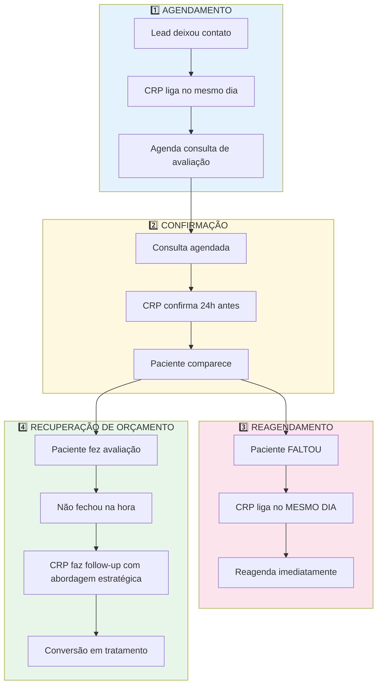

# 📞 Script de Follow-Up — Processos Internos de Vendas

> [!ABSTRACT] Base Estratégica
> Este script é baseado no **Terceiro Pilar da Estratégia de Vendas** para clínicas odontológicas: **Processos Internos**. Adaptado do framework do Dr. Leonardo Monteiro para a realidade da Clínica da Dra. Patrícia Nogueira.
> 
> Uma clínica odontológica é uma **empresa**, e toda empresa precisa de processos para vender. O Consultor de Relacionamento com o Paciente (CRP) — a secretária — deve executar **4 tarefas críticas diárias** para transformar potenciais pacientes em pacientes reais.

---

## 🎯 OS 4 PILARES DO FOLLOW-UP DIÁRIO



---

## 📋 Pilar 1 — Agendamento de Consultas (Primeiro Contato)

> [!IMPORTANT] Regra de Ouro
> O lead que deixou o contato hoje deve ser ligado **no mesmo dia** ou, no máximo, nas primeiras 2 horas. Quanto mais tempo passa, mais frio fica o interesse.

### 🎯 Objetivo
Transformar um contato de anúncio (Instagram, Google, indicação) em uma **consulta de avaliação agendada**.

### 📞 Script de Ligação — Agendamento

**Abertura (0-15 seg)**
> *"Oi, [Nome]! Tudo bem? Aqui é [Nome da CRP] da Clínica da Dra. Patrícia. Vi que você deixou seu contato no nosso anúncio sobre [implante/lente/clareamento/harmonização]. Obrigada pela confiança!"*

**Qualificação (15seg-1min)**
> *"[Nome], para eu te ajudar da melhor forma: o que te motivou a procurar sobre [procedimento] agora? Você está sentindo alguma dor ou é mais por estética?"*

**Construção de Valor (1-2min)**
> *"Perfeito, entendi! Saiba que a Dra. Patrícia é especialista nisso. Ela tem mais de 16 anos de experiência, foi Oficial Dentista do Exército, e já ajudou centenas de pessoas com cases parecidos com o seu. Cada tratamento aqui é personalizado."*

**Fechamento do Agendamento (2-3min)**
> *"[Nome], para a Dra. avaliar seu caso e te passar um planejamento completo, precisamos de uma consulta presencial. Ela vai examinar, tirar fotos e montar um orçamento sob medida para você."

> *"Tenho duas opções esta semana: [Dia 1] às [Hora 1] ou [Dia 2] às [Hora 2]. Qual fica melhor para você?"*

**Confirmação e Encerramento**
> *"Maravilha! Então fica para [dia] às [hora]. Vou te enviar um lembrete no WhatsApp. Tem alguma dúvida antes de vir?"

> *"Ah, só um detalhe: traga exames antigos se tiver, e evite comer muito pesado antes. Te espero! 😊"*

---

### 📱 Script WhatsApp — Agendamento (Se não atender a ligação)

```
Oi, [Nome]! 😊 Aqui é [Nome da CRP] da Clínica da Dra. Patrícia.

Vi que você deixou seu contato no nosso anúncio sobre [procedimento]. Obrigada por procurar a gente!

A Dra. Patrícia é especialista nisso e adoraria conversar com você. Posso te ligar rapidinho para agendar uma avaliação? Ou, se preferir, me diga qual dia e hora funcionam para você.

Fico no aguardo! 💙
```

### ❌ Erros Comuns no Agendamento

| ❌ Errado | ✅ Correto |
|-----------|-----------|
| "Quanto você quer gastar?" | "Vamos entender seu caso primeiro" |
| "Mando o preço por WhatsApp" | "A Dra. precisa avaliar presencialmente" |
| "Amanhã te ligo" | Vai ligar no mesmo dia, nas primeiras 2 horas |
| "Deixa seu recado que a Dra. liga" | A CRP liga, qualifica e agenda |
| "Temos vaga na semana que vem" | "Tenho [dia/hora] ou [dia/hora] esta semana" |

---

## 📋 Pilar 2 — Confirmação de Consulta (Garantir Comparecimento)

> [!IMPORTANT] Regra de Ouro
> Pacientes de anúncio **não são fidelizados**. Eles não te conhecem e não têm comprometimento. Por isso, a confirmação deve ser **mais intensa** que para pacientes antigos.

### 🎯 Objetivo
Garantir que o paciente agendado realmente **compareça** à consulta de avaliação.

### ⏱️ Protocolo de Confirmação

| Momento | Ação | Canal |
|---------|------|-------|
| **24h antes** | 1ª confirmação | WhatsApp + Ligação |
| **3h antes** | 2ª confirmação | WhatsApp |
| **30min antes** | 3ª confirmação (se necessário) | WhatsApp |

---

### 📞 Script de Ligação — Confirmação 24h Antes

> *"Oi, [Nome]! Aqui é [Nome da CRP] da Clínica da Dra. Patrícia. Passando para confirmar sua consulta de amanhã, [dia], às [hora]. Tudo certo para você?"*

**Se confirmar:**
> *"Perfeito! Te espero amanhã. Lembre-se de chegar com 10 minutinhos de antecedência. Qualquer coisa, me chama aqui no WhatsApp. Até lá!"*

**Se vacilar:**
> *"Tudo bem, [Nome], entendo. Mas a Dra. Patrícia preparou esse horário especialmente para você e a agenda dela está bem fechada. Se precisar remarcar, me avisa com antecedência para eu conseguir repassar a vaga, tá?"*

---

### 📱 Script WhatsApp — Confirmação 24h Antes

```
Oi, [Nome]! 😊 Aqui é [Nome da CRP] da Clínica da Dra. Patrícia.

Passando para confirmar sua consulta amanhã, [dia], às [hora]. Tudo certinho?

A Dra. já separou seu horário e está ansiosa para te conhecer!

Se precisar remarcar, me avisa com antecedência, por favor. 💙
```

### 📱 Script WhatsApp — Confirmação 3h Antes (para pacientes de anúncio)

```
Oi, [Nome]! Tudo bem? 😊

Só um lembrete: sua consulta com a Dra. Patrícia é hoje às [hora].

📍 Endereço: [Endereço da Clínica]
⏰ Chegar 10 min antes
📄 Se tiver exames antigos, traga

Te espero! Qualquer coisa me chama aqui. 💙
```

---

### 📊 Taxa de Comparecimento

| Tipo de Paciente | Confirmação | Comparecimento Médio |
|------------------|-------------|---------------------|
| Paciente antigo (fidelizado) | WhatsApp 24h antes | 85-90% |
| Paciente de anúncio (novo) | Ligação + WhatsApp 24h + WhatsApp 3h | 60-70% |
| Paciente de anúncio (alto ticket) | Ligação + WhatsApp 24h + WhatsApp 3h + Ligação 30min | 75-80% |

> [!TIP] Quanto mais energia na confirmação, maior o comparecimento. Não economize contatos com leads novos.

---

## 📋 Pilar 3 — Reagendamento de Faltas (No Mesmo Dia!)

> [!IMPORTANT] Regra de Ouro — Prioridade Máxima
> Se o paciente FALTAR, a CRP deve ligar **no mesmo dia da falta**. Quanto mais dias passam, mais frio fica o lead. Um dia de atraso pode custar a conversão.

### 🎯 Objetivo
Reconectar com o paciente que faltou e **reagendar imediatamente**, antes que ele esfrie completamente.

### 📞 Script de Ligação — Reagendamento (Mesmo Dia da Falta)

> *"Oi, [Nome]! Aqui é [Nome da CRP] da Clínica da Dra. Patrícia. Tudo bem?"

> *"[Nome], a gente estava te esperando hoje às [hora] para sua avaliação com a Dra. Aconteceu alguma coisa?"

**(Ouvir atentamente — não julgar)**

> *"Tudo bem, acontece! A vida é assim mesmo. 😊 O importante é que a gente consiga cuidar de você."

> *"A Dra. Patrícia separou outro horário especial para você. Tenho [dia/hora] ou [dia/hora]. Consegue uma dessas?"

**Se o paciente disser "vou confirmar depois":**
> *"Claro, [Nome], mas me deixa já reservar uma vaga para você. A agenda da Dra. está bem cheia. Se confirmar agora, eu garanto seu lugar. Senão, pode ser que eu não consiga mais. Tenho [dia/hora], dá certo?"

---

### 📱 Script WhatsApp — Reagendamento (Se não atender a ligação)

```
Oi, [Nome]! 😊 Aqui é [Nome da CRP] da Clínica da Dra. Patrícia.

A gente estava te esperando hoje para sua avaliação com a Dra. Aconteceu alguma coisa? Espero que esteja tudo bem! 🙏

Quando puder, me responde para a gente remarcar. A Dra. pediu para eu cuidar de você com carinho e garantir que a gente consiga fazer essa avaliação.

Tenho [dia/hora] ou [dia/hora]. Qual te agrada mais?
```

---

### ❌ Erros Fatais no Reagendamento

| ❌ Erro Fatal | ✅ Correto |
|---------------|-----------|
| Deixar para ligar no dia seguinte | Liga no **mesmo dia** da falta |
| "Você faltou" | "A gente estava te esperando, aconteceu alguma coisa?" |
| Mandar mensagem genérica | Personalizar e oferecer horários específicos |
| "Quer remarcar?" | "Tenho [dia/hora] ou [dia/hora] para você" |
| Não registrar o motivo da falta | Anotar no CRM: medo, esqueceu, emergência, etc. |
| Dar opção de "depois" | Criar escassez suave: "agenda está cheia" |

---

## 📋 Pilar 4 — Recuperação de Orçamento (Pós-Avaliação)

> [!IMPORTANT] Regra de Ouro
> O paciente que fez avaliação e não fechou na hora é um **lead quente**. Ele já conhece a clínica, a Dra., e o valor. A objeção costuma ser: preço, tempo, medo, ou "preciso conversar com alguém".

### 🎯 Objetivo
Recuperar pacientes que fizeram avaliação mas não fecharam o tratamento no mesmo dia, usando **abordagens estratégicas de follow-up**.

### ⏱️ Cronograma de Follow-Up de Orçamento

| Dia | Ação | Canal | Objetivo |
|-----|------|-------|----------|
| **D+0** (noite da avaliação) | Mensagem de agradecimento | WhatsApp | Acolhimento e reforço de valor |
| **D+1** | 1ª tentativa de fechamento | Ligação | Resolver objeção principal |
| **D+2** | 2ª tentativa | WhatsApp | Reapresentar plano com benefício |
| **D+4** | 3ª tentativa | Ligação | Oferecer condição especial |
| **D+7** | 4ª tentativa | WhatsApp | Última proposta antes de pausar |

---

### 📱 Script D+0 — Agradecimento (Noite da Avaliação)

```
Oi, [Nome]! 😊 Aqui é [Nome da CRP] da Clínica da Dra. Patrícia.

Passando para agradecer sua visita hoje! Foi um prazer te receber.

A Dra. Patrícia adorou conversar com você e montar o planejamento do seu tratamento. Ela me pediu para te lembrar que estamos aqui sempre que você precisar tirar dúvidas.

Sei que é uma decisão importante. Pense com calma, e qualquer coisa me chama.

Boa noite! 💙
```

> [!TIP] Este é o toque que diferencia. A maioria das clínicas NÃO agradece no mesmo dia. Isso gera conexão emocional.

---

### 📞 Script D+1 — 1ª Tentativa de Fechamento (Ligação)

> *"Oi, [Nome]! Aqui é [Nome da CRP] da Clínica da Dra. Patrícia. Tudo bem?"

> *"[Nome], a Dra. me pediu para ligar para você. Ela ficou pensando no seu caso depois da avaliação e queria saber se conseguiu conversar com [esposo/marido/família] sobre o planejamento."

**Se disser "está caro":**
> *"Entendo, [Nome]. É um investimento. Mas posso te adiantar: a Dra. montou o planejamento pensando no melhor resultado para você, e a gente tem condições de pagamento que podem facilitar. Posso te explicar?"

**Se disser "preciso pensar":**
> *"Claro, é uma decisão importante. Mas me conta: o que está te deixando em dúvida? É o valor? É o tempo? É algum medo? Se eu souber, posso te ajudar a clarear."

**Se disser "vou fazer em outro lugar":**
> *"Entendo, [Nome]. Respeito sua decisão. Só te peço um favor: antes de decidir, compara tudo. A Dra. Patrícia tem uma forma de trabalho muito cuidadosa, e o resultado dela fala por si. Se um dia quiser conversar de novo, estamos aqui."

---

### 📱 Script D+2 — 2ª Tentativa (WhatsApp)

```
Oi, [Nome]! 😊 Aqui é [Nome da CRP].

A Dra. Patrícia me pediu para te passar uma novidade: a gente conseguiu uma condição especial de parcelamento para o seu tratamento de [procedimento].

Em vez de [condição original], agora dá para fazer em [nova condição]. Isso pode facilitar bastante.

Se quiser, posso te ligar rapidinho para explicar?
```

> [!NOTE] A "novidade" deve ser real. Nunca invente condições que não existem. Trabalhe com a Dra. Patrícia para criar possibilidades reais.

---

### 📞 Script D+4 — 3ª Tentativa (Ligação + Condição Especial)

> *"Oi, [Nome]! Aqui é [Nome da CRP] da Clínica da Dra. Patrícia."

> *"[Nome], a Dra. Patrícia me autorizou a te fazer uma proposta especial. Para você começar o tratamento ainda este mês, a gente pode [benefício real: entrada reduzida / parcelamento estendido / inclusão de procedimento extra]."

> *"Essa condição é válida só até [data]. A Dra. topou fazer isso porque ela realmente quer cuidar do seu caso. O que acha?"

---

### 📱 Script D+7 — 4ª Tentativa (Última Proposta)

```
Oi, [Nome]. 💙 Aqui é [Nome da CRP] da Clínica da Dra. Patrícia.

Fizemos algumas tentativas de conversar sobre o seu tratamento e respeitamos muito seu tempo para decidir.

A Dra. pediu para eu te fazer uma última proposta: se você topar começar ainda esta semana, a gente garante [benefício final].

Se não for o momento, tudo bem. Mas se quiser, essa é a última janela com essa condição.

Me avisa? 😊
```

> [!IMPORTANT] Após D+7 sem resposta, pause o follow-up ativo. O paciente entra no ciclo de [[SCRIPT-REATIVACAO-WHATSAPP-GENERAL|Reativação Geral]] após 30 dias.

---

## 📊 Matemática do Follow-Up (Projeção de Resultados)

> [!TIP] Dica do Leonardo Monteiro
> Se a CRP desenvolver as 4 tarefas todos os dias, é **impossível** não trazer resultados.

| Tarefa Diária | Meta | Pacientes/Dia | Pacientes/Mês (20 dias) |
|---------------|------|---------------|-------------------------|
| Agendamento | 3 leads → 1 agendado | 1 | 20 |
| Confirmação | 100% dos agendados | — | — |
| Reagendamento de faltas | 2 faltas → 1 reagendado | 1 | 20 |
| Recuperação de orçamento | 2 pendentes → 1 fechado | 1 | 20 |
| **TOTAL** | | **3-4** | **60-80** |

> Com **ticket médio de R$ 3.000-5.000**, 20 pacientes fechando tratamento = **R$ 60.000-100.000/mês**.

---

## 🎯 Checklist Diário da CRP

### Manhã (Abertura)
- [ ] Verificar leads novos de anúncios (últimas 24h) e ligar
- [ ] Verificar agendamentos do dia seguinte → confirmar
- [ ] Verificar agendamentos de hoje → reconfirmar 3h antes

### Tarde
- [ ] Verificar faltas do dia → ligar no mesmo dia para reagendar
- [ ] Verificar orçamentos pendentes (D+1, D+2, D+4, D+7) → executar follow-up
- [ ] Atualizar CRM com resultados de todas as tentativas

### Final do Dia
- [ ] Reportar para gestão: quantos agendamentos, quantas confirmações, quantas faltas reagendadas, quantos orçamentos recuperados
- [ ] Preparar lista de follow-up para o dia seguinte

---

## 🔗 Links Relacionados

- [[SCRIPT-ACOLHIMENTO]]
- [[SCRIPT-FECHAMENTO]]
- [[SCRIPT-REATIVACAO-WHATSAPP-GENERAL]]
- [[SCRIPT-REATIVACAO-LIGACAO]]
- [[SCRIPT-REATIVACAO-TRATAMENTO-INCOMPLETO]]
- [[SCRIPT-REATIVACAO-ALTO-VALOR]]
- [[FUNIL-VENDAS]]
- [[MANUAL-SECRETARIA]]
- [[TEMPLATE-ROTINA-DIARIA]]
- [[PLANEJAMENTO-SEMANAL-SECRETARIA]]

---

> [!TIP] Dica de Ouro
> A secretária que apenas "atende telefone" custa caro. A secretária que **executa os 4 pilares de follow-up** é um investimento que se paga sozinho. Treine, acompanhe e motive a CRP como a peça mais valiosa da clínica.

> [!CAUTION] LGPD / Ética
> Nunca pressione pacientes a comprar tratamentos que não precisam. O follow-up é para **ajudar a decidir**, não forçar. Respeite o "não" e mantenha a dignidade do paciente acima de tudo.
