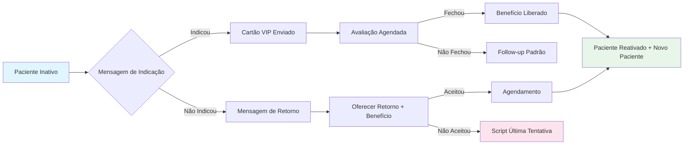

# 👥 Script de Reativação - Via Programa de Indicação (Reativação Social)

> [!ABSTRACT] Quando usar
> Use este script para reativar pacientes inativos através do **Programa de Indicação**. Em vez de vender diretamente para o paciente inativo, você o convida a **indicar alguém**, reativando-o indiretamente e ainda expandindo a base de pacientes.

---

## 🎯 OBJETIVOS

1. **Reativar o vínculo** sem pressão de compra
2. **Mobilizar** o paciente como embaixador da clínica
3. **Captar novos pacientes** através de indicação qualificada
4. **Oferecer benefício** ao paciente inativo (voucher, desconto, brinde)
5. **Criar motivo** para o paciente retornar (resgatar benefício)

---

## 👥 MENSAGEM 1 — Convite para Indicar (WhatsApp)

> **Timing:** Terça ou Quinta, 10h-17h
> **Público:** Pacientes inativos há 12+ meses, com histórico positivo

```
Olá, [Nome]! 😊 Aqui é a [Nome da Secretária] da Clínica da Dra. Patrícia.

Passando para te dar um oi especial. Faz um tempo que a gente não se vê, mas eu nunca esqueci como você foi um paciente incrível por aqui.

A Dra. Patrícia está com um projeto lindo: ela quer ajudar mais pessoas a terem sorrisos que transformam vidas. E sabe quem melhor pode ajudar nisso? Pacientes como você, que já conhecem o cuidado e a qualidade do nosso trabalho.

[Nome], você conhece alguém que está buscando um dentista de confiança? Alguém que sonha em cuidar do sorriso, fazer harmonização, ou finalmente resolver aquele problema na boca?

Se indicar alguém e a pessoa marcar uma avaliação, a gente tem um presente especial para você: [benefício — ex: voucher de R$ 150 para qualquer procedimento, ou sessão de clareamento gratuito].

E olha: se quiser aproveitar o presente pessoalmente, a gente adoraria te ver de novo por aqui! 💙
```

> [!TIP] Estratégia
> O paciente inativo pode não querer um tratamento agora, mas todo mundo conhece alguém que precisa de dentista. Indicação é reativação disfarçada.

---

## 👥 MENSAGEM 2 — Se o paciente disser "vou indicar"

```
Que notícia boa, [Nome]! 🎉

A Dra. Patrícia vai ficar feliz em receber quem você indicar. A gente cuida muito bem de quem vem recomendado — é uma responsabilidade que a gente leva a sério.

Para facilitar, posso te enviar um link especial ou um cartão digital que você encaminha para a pessoa. Assim a indicação fica registrada em seu nome e você garante seu benefício.

Quem você tem em mente? Me conta que eu já preparo tudo!
```

---

## 👥 MENSAGEM 3 — Se o paciente disser "não conheço ninguém"

```
Sem problema nenhum, [Nome]! 😊

A gente nunca sabe quando alguém próximo vai precisar, né? Se um dia lembrar de alguém, é só me chamar.

E falando nisso... a gente sente sua falta por aqui! Se quiser aproveitar para fazer uma visitinha, a Dra. Patrícia tem vagas especiais para pacientes que já passaram por aqui. Só para conversar e ver como está tudo.

O benefício do programa de indicação também vale para você, sabia? Se você voltar e trazer alguém, vocês dois ganham!
```

---

## 👥 MENSAGEM 4 — Reactivação via "Cartão de Indicação VIP"

```
Olá, [Nome]! 💎

Você sempre foi um paciente especial para a Dra. Patrícia. Por isso, preparamos algo exclusivo para você.

Anexamos a este WhatsApp um "Cartão VIP de Indicação". Você pode encaminhar para até 2 pessoas que você ama. Quando elas agendarem a avaliação, você ganha:

🎁 [Benefício 1 — ex: sessão de clareamento]
🎁 [Benefício 2 — ex: voucher de R$ 200]

E o melhor: se uma das pessoas que você indicar fechar um tratamento, você ganha ainda mais.

Este cartão é seu. Use com carinho! 💙
```

> [!IMPORTANT] Regra de Ouro
> O benefício deve ser real e de valor percebido. Voucher de R$ 20 não motiva ninguém. Sessão de clareamento ou R$ 150+ sim.

---

## 📞 SCRIPT DE LIGAÇÃO — PROGRAMA DE INDICAÇÃO

### Abertura:
> *"Oi, [Nome]! Tudo bem? Aqui é a [Nome da Secretária] da Clínica da Dra. Patrícia. Estou te ligando com uma novidade especial."*

### Contexto:
> *"A Dra. Patrícia lançou um programa de indicação para pacientes que já conhecem a qualidade do nosso trabalho. E você foi uma das primeiras pessoas que eu pensei."*

### Convite:
> *"Você conhece alguém que está procurando um dentista de confiança? Alguém que fala em fazer lente, implante, ou harmonização? Se indicar e a pessoa marcar, você ganha [benefício]."*

### Fechamento:
> *"E claro, se quiser aproveitar para passar aqui também, a gente adoraria te ver! Posso te enviar o cartão de indicação pelo WhatsApp?"*

---

## 🎁 OPÇÕES DE BENEFÍCIO (Escolher conforme realidade da clínica)

| Indicação | Benefício ao Indicador | Benefício ao Indicado |
|-----------|----------------------|----------------------|
| 1 avaliação agendada | Sessão de clareamento | Avaliação gratuita |
| 1 tratamento fechado | Voucher R$ 200 | 10% de desconto no tratamento |
| 2 indicações | Voucher R$ 350 | Avaliação + fotos |
| 3 indicações | Sessão de Botox | 15% de desconto |

> [!NOTE] Ajuste de Benefício
> Ajuste os valores conforme o ticket médio da clínica. Regra: o benefício ao indicador deve valer a pena o esforço dele, mas não comprometer a margem da clínica.

---

## 🔄 FLUXO DE REATIVAÇÃO POR INDICAÇÃO



---

## 🚫 O QUE NUNCA FAZER

| ❌ Errado | ✅ Correto |
|-----------|-----------|
| "Ganhe dinheiro indicando" | "Ganhe um presente especial" |
| "Você precisa trazer gente" | "Você conhece alguém que precisa?" |
| "É tipo Marketing Multinível" | "É nosso programa de pacientes VIP" |
| Falar do benefício antes da indicação | Falar do programa, depois do benefício |
| Prometer benefício sem registro | Sempre registrar indicação no CRM |
| Esquecer de entregar o benefício | Entregar imediatamente quando válido |

---

## 🔗 Links Relacionados

- [[SCRIPT-REATIVACAO-WHATSAPP-GENERAL]]
- [[SCRIPT-REATIVACAO-LIGACAO]]
- [[SCRIPT-REATIVACAO-ALTO-VALOR]]
- [[SCRIPT-REATIVACAO-TRATAMENTO-INCOMPLETO]]
- [[SCRIPT-REATIVACAO-ANIVERSARIO]]
- [[SCRIPT-REATIVACAO-ULTIMA-TENTATIVA]]
- [[Script-Voucher-Indicacao]]
- [[FUNIL-VENDAS]]

---

## ✅ Checklist de Uso

- [ ] Definir benefício real e viável para o programa
- [ ] Criar cartão digital de indicação (Canva/Photoshop)
- [ ] Filtrar no CRM: pacientes inativos 12+ meses com histórico positivo
- [ ] Treinar secretária para apresentar programa como "novidade VIP", não como "promoção"
- [ ] Registrar cada indicação no CRM (quem indicou, quem foi indicado, data)
- [ ] Acompanhar se a indicação agendou, compareceu, fechou
- [ ] Liberar benefício ao indicador IMEDIATAMENTE após confirmação
- [ ] Medir: taxa de indicação, custo por indicação, taxa de fechamento de indicados
- [ ] Fazer reunião mensal de análise do programa

> [!TIP] Dica de Ouro
> O programa de indicação é a **form mais barata de marketing** e a **reativação mais elegante**. O paciente inativo não se sente pressionado a comprar — ele se sente **valorizado e convidado a ajudar**. E muitas vezes, ao indicar, ele próprio se lembra do quanto precisa voltar.
