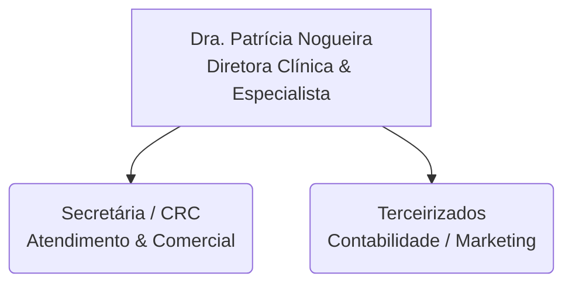
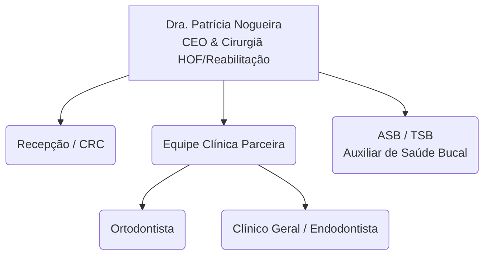

# 🏢 Organograma da Clínica Dra. Patrícia

## 🟡 Estrutura Atual (Fase 1: Consolidação)
A clínica opera com uma equipe enxuta, focada em eficiência e maximização do tempo da dentista principal.

## 🟢 Visão de Futuro (Fase 2: Escala 100K)
Estrutura projetada para quando os procedimentos de baixo ticket forem delegados, liberando a Dra. Patrícia apenas para as cirurgias e HOF.

> [!TIP] Próximo Passo de RH
> A contratação mais urgente para escalar o faturamento da Dra. Patrícia será um **ASB (Auxiliar de Saúde Bucal)** ou um **Dentista Clínico Geral**, para liberar o tempo dela das limpezas e restaurações simples.
